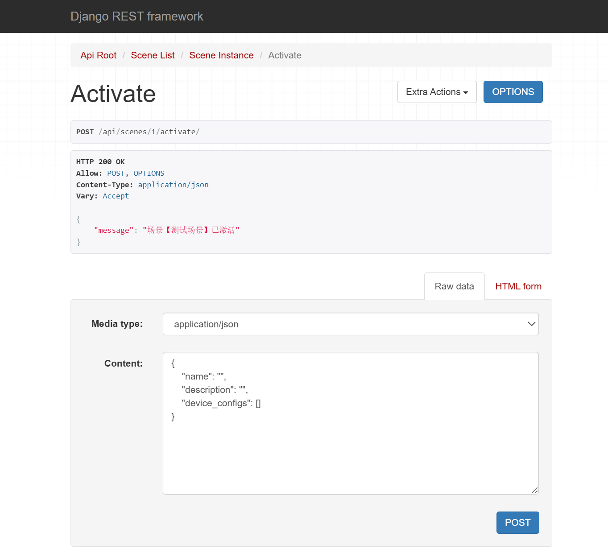
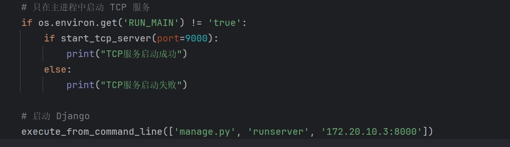

## 后端任务

- DONE  根据前端写出数据模型，可以实现通过json创建 Room、Device、Scene 等资源。
  - 具体的请求示例可以看下方
- DONE scene activate/deactive函数 一键设置所有的设备(post提交一个空的东西就可以激活)
  
- DONE TCP连接：经过测试，已经可以实现不同ip地址，客户端向服务器发送命令，然后服务器使用日志记录并执行对应操作，然后返回客户端一个确认消息。
- DONE 日志
- DONE 登录模块  //经过test_api.py测试  
- 测试文件  //可以参考test_api.py

---

## api参考

一、创建 Room（房间）
请求地址

```
POST /api/rooms/
```

请求体

```json
{
  "name": "书房"
}
```

 二、创建 Device（设备）
请求地址

```
POST /api/devices/
```

请求体

```json
{
  "name": "书房台灯",
  "type": "light",
  "room": 1,  // 房间的ID（外键）
  "status": true,
  "extra": {
    "brightness": 80,
    "color": "#FFDD88"
  }
}
```

🔸 注意事项：

* `room` 要传房间的 `id`。
* `extra` 是一个自由格式的字典（JSON对象），可以存 brightness、temperature、volume 等属性。

三、创建 Scene（场景）
请求地址

```
POST /api/scenes/
```

请求体

```json
{
  "name": "工作模式",
  "description": "打开书房台灯，调整亮度",
  "device_configs": [
    {
      "device": 6,  // 设备ID（如书房台灯）
      "status": true,
      "config": {
        "brightness": 100
      }
    },
    {
      "device": 2,  // 设备ID（如卧室空调）
      "status": true,
      "config": {
        "temperature": 25
      }
    }
  ]
}
```

注意事项：

* `device_configs` 是一个列表，每个元素表示一个设备的目标配置；
* 每项需要包括：

  * `device`: 设备 ID；
  * `status`: 是否开启；
  * `config`: 附加参数，如亮度、温度等。

四、修改（PUT 或 PATCH）

可以通过 PUT 或 PATCH 来修改上述资源，比如：
修改设备状态

```
PATCH /api/devices/6/
```

```json
{
  "status": false
}
```

修改场景描述

```
PATCH /api/scenes/1/
```

```json
{
  "description": "新的描述"
}
```

## 字段对照表

| 模型     | 字段名             | 类型             | 说明                    |
| -------- | ------------------ | ---------------- | ----------------------- |
| Room     | `name`           | string           | 房间名称                |
| Device   | `name`           | string           | 设备名                  |
|          | `type`           | string           | 类型，如 light、ac 等   |
|          | `room`           | integer (外键ID) | 所属房间                |
|          | `status`         | boolean          | 开关状态                |
|          | `extra`          | dict             | 配置，如亮度、温度等    |
| Scene    | `name`           | string           | 场景名称                |
|          | `description`    | string           | 场景说明                |
|          | `device_configs` | list of dicts    | 设备目标状态及配置      |
| Config项 | `device`         | integer (外键ID) | 被控制的设备            |
|          | `status`         | boolean          | 打开/关闭               |
|          | `config`         | dict             | 额外配置，如亮度/温度等 |

## TCP消息传递

首先运行后端的run_server.py（里面包含Django的启动和TCP的监听），然后模拟客户端的控制，运行client.py，模拟客户端向服务器发送消息（服务器和客户端要在同一子网内，且client需要指定server的ip（可变）和端口：9000（可变），需要在settings里面添加服务器的ip地址。下面是具体介绍：

### 后端配置和开启tcp监听

如下，位于run_server.py



需要指定自己的ip地址（此处为172.20.10.3，可以改）和django的端口（8000），然后使用9000端口进行tcp监听

如果使用自己的ip地址，需要在**settings.py**里面添加.

```
# 允许本地局域网访问
ALLOWED_HOSTS = [
    '172.20.10.3',
    'localhost',
    '127.0.0.1'
]
```

然后运行run_server.py

```bash
python run_server.py
```

就可以启动后端了。

### 模拟客户端

位于**client.py**中，有一段向服务器发送TCP请求的代码，已经可以实现服务器的接收，完成对应动作，最后返回TCP内容的执行结果到客户端：

```python
def send_tcp_command(host='172.20.10.3', port=9000, command=None, timeout=5):
```

如上，该函数指定了对应的ip地址和tcp端口，修改即可。

```python
command = {
    "operation": "create",  # 这是关键字段
    "id": 18,
    "name": "台灯",
    "type": "light",
    "room": 1,  # 注意是 room
    "status": True,
    "extra": {
        "brightness": 80,
        "color": "#FFDD88"
    },
    "brand": None
}
```

一个command的例子如上，TCP提供了以下几个操作，详情请查看core/tcp_server.py支持的内容（handle_tcp_command函数）：

| 操作 | create | update | delete | control |
| ---- | ------ | ------ | ------ | ------- |

经过测试，已经可以实现不同ip地址，客户端向服务器发送命令，然后服务器使用日志记录并执行对应操作，然后返回客户端一个确认消息。

日志位于**/logs/tcp.log**中

已经成功测试。
